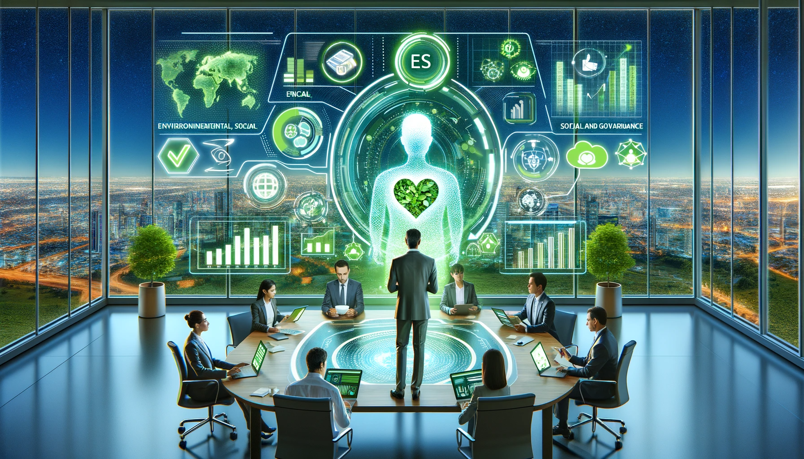

🌿🌍 **ESG AI Strategist** is at the forefront of environmental, social, and governance innovation, leveraging the power of artificial intelligence to redefine sustainability in the corporate world. This pioneering AI-based application offers in-depth insights and actionable strategies for companies and decision-makers, enabling them to not only align with but also excel in ESG practices and Sustainable Development Goals (SDGs).

🌱🌏 Whether it's navigating the complexities of sustainable practices, crafting robust ESG frameworks, or integrating global SDGs into corporate ethos, ESG AI Strategist is your ultimate ally. With its cutting-edge technology, this tool empowers businesses to make informed, ethical decisions that lead to a sustainable, prosperous future for all.

Embrace the change, drive innovation, and become a leader in the global movement towards a more responsible, eco-friendly, and equitable world. 🚀🌟

### Key Features of ESG AI Strategist GPT

- Leveraging LLMs (Gemini Pro & Gemini Pro Vision) to redefine sustainability in the corporate sector.
- Provides in-depth insights for ESG practices and sustainable development goals.
- Backed by Gemini Pro and Gemini Pro Vision for multimodal capabilities.
- Analyzes infographics to understand key areas and generate valuable insights.
- Generates PowerPoint presentations from AI conversations.
- Features 'TruLens Leaderboard' right in the app to show RAG triad of metrics (answer relevancy, context relevancy, and groundedness) in a streamlined way.
- Offers detailed analysis of user inputs and AI responses.
- Evaluates performance of Gemini completions using TruLens based on both predefined questions and personalized conversation history.

### App Demo

To see the ESG AI Strategist GPT in action, check out the following link. This app showcases the key features and capabilities of the application, providing a hands-on experience with its functionalities.

[Explore the app](https://esg-multimodal-gpt.streamlit.app/)

### Demo Highlights
- Explore how the app leverages LLMs for sustainability insights.
- See the multimodal capabilities in action, including infographic analysis.
- Discover the TruLens Leaderboard and its metrics visualization.

_For an optimal experience, we recommend viewing the demo on a desktop browser._

